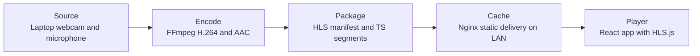

# Chapter 1 Design Document

## Objective

Build a live streaming application that runs only on the local network and allows a small group of viewers to watch the broadcaster's laptop webcam feed at the same time through a browser or media player. The system should be built from scratch and should make the full delivery path easy to explain and debug.

## Requirements

- Live stream plays in a browser or media player on the local network.
- The stream holds up with several simultaneous viewers.
- The implementation can be traced end to end as source -> encode -> package -> cache -> player.
- The document explains the key design decisions behind the solution.

## Scope

### Included

- One broadcaster laptop webcam feed.
- One live channel.
- Local network delivery only.
- Browser playback through the existing frontend application.
- A backend control layer that manages stream state and delivery.
- Enough observability to explain where failures occur in the pipeline.

### Excluded

- Internet-facing delivery.
- Authentication or access control.
- Recording and video-on-demand workflows.
- Adaptive bitrate ladders.
- Ultra-low-latency delivery for operations monitoring.
- Cloud deployment and production redundancy.

## Proposed Architecture

The recommended Chapter 1 implementation is a Windows-native HLS pipeline. The broadcaster laptop captures webcam and microphone input, FFmpeg encodes that input and packages it into rolling HLS output, a local cache layer serves the generated files on the LAN, and the frontend player consumes the manifest with HLS.js.

## Component Design

### Source

The broadcaster uses the laptop webcam as the video source and the laptop microphone as the audio source. This keeps capture simple, avoids extra hardware dependencies, and matches the chapter requirement directly.

### Encode

FFmpeg is responsible for capture and encoding. It will ingest the Windows webcam and microphone devices, encode video as H.264 and audio as AAC, and maintain a stable output profile suitable for LAN delivery. FFmpeg is the right choice here because it is mature, widely used in streaming workflows, and supports both device capture and HLS packaging without introducing another media server.

### Package

The encoded stream is packaged as HLS with a short rolling playlist. FFmpeg writes a manifest file and a bounded set of transport stream segments to disk. HLS was chosen because it is easy to validate, works well with browser playback through HLS.js, and naturally supports multiple concurrent viewers requesting the same segment files.

Recommended initial packaging settings:

- Video codec: H.264.
- Audio codec: AAC.
- Segment duration: 2 to 4 seconds.
- Playlist window: 5 to 10 segments.
- Output location: a dedicated local HLS directory managed by the backend.

### Cache

The preferred design includes a lightweight Nginx layer in front of the generated HLS directory. Even on a local network, keeping cache and delivery separate from encoding is useful because it makes the pipeline easier to reason about and reduces coupling between media generation and viewer traffic. Nginx is a better fit than the application server for repeated static reads of manifests and segments.

If minimizing moving parts becomes more important than architectural separation, the backend can temporarily serve the HLS directory itself. That fallback still works for the chapter checkpoint, but the document should then be explicit that package and cache have been collapsed into the same process for the MVP.

### Player

The frontend will replace the starter page with a dedicated viewer page built with React and HLS.js. The player should connect to the LAN-accessible manifest URL, render standard playback controls, and surface useful states such as loading, offline, and playback error. A small diagnostics panel should expose the manifest URL, whether the stream is live, and recent playback failures so the delivery path remains easy to trace during testing.

### Backend Control Plane

The backend is not the media encoder, but it should still own the operational workflow. It should provide:

- Configuration for device names, output paths, and LAN-facing URLs.
- Stream start and stop control, whether fully automated or wrapping documented FFmpeg commands.
- Health and status endpoints for the frontend.
- Cleanup of stale manifests and segments.
- Logging for FFmpeg process output and failure recovery.

This separation keeps the system understandable: FFmpeg handles media work, Nginx handles static delivery, and the backend handles orchestration.

## End-to-End Path

The complete Chapter 1 path is:

1. Source: the broadcaster laptop webcam and microphone are captured on Windows.
2. Encode: FFmpeg compresses the raw input into H.264 video and AAC audio.
3. Package: FFmpeg writes a rolling HLS manifest and segment files.
4. Cache: Nginx serves the generated files over HTTP on the local network.
5. Player: the React app requests the manifest, fetches segments, buffers them, and plays the stream in the browser.

This path satisfies the requirement that the system be explainable from capture to playback.

## Key Design Decisions

### Why HLS for Chapter 1

HLS is not the lowest-latency streaming format, but it is the best fit for this chapter. It is straightforward to generate with FFmpeg, supports multiple viewers well, and integrates cleanly with browser playback through HLS.js. The added delay is acceptable for Chapter 1 because the requirement is reliable local-network delivery, not ultra-low latency.

### Why a Cache Layer on a Local Network

The local network reduces bandwidth distance, but it does not remove the value of a delivery layer. A separate cache-serving step makes the architecture cleaner, prevents the encoder process from also acting as the asset server, and gives a clearer explanation of how this design would evolve toward a larger OTT platform later.

### Why Windows-Native Instead of Containers

This chapter is optimized for fast local validation on the broadcaster laptop. Running FFmpeg directly on Windows simplifies webcam access and avoids extra container setup for device passthrough. That makes the first implementation easier to stand up and debug.

### Why a Single Channel and Fixed Profile

A single live channel with one encoding profile keeps Chapter 1 focused on proving the pipeline instead of building production-grade distribution logic. Multi-bitrate packaging and more advanced origin behavior can be added in later chapters if needed.

## Risks and Tradeoffs

- HLS introduces noticeable latency compared with low-latency protocols. This is acceptable for Chapter 1 but will not satisfy the Chapter 2 monitoring use case.
- Webcam device naming on Windows can be inconsistent across machines. The setup flow should validate the actual device names before testing the stream.
- Shorter HLS segments reduce playback delay but increase file churn and I/O pressure.
- If Nginx is omitted, the system becomes simpler to run but less clean architecturally because cache and application delivery are merged.
- FFmpeg is a single point of failure in this design, so the backend should at least capture logs and expose stream health.

## Verification Plan

The implementation will be considered complete when the following checks pass:

1. FFmpeg can capture the target webcam and microphone and continuously generate a valid rolling HLS manifest with segment files.
2. The manifest and the newest segments are reachable from another machine on the same local network by using the broadcaster host IP, not only localhost.
3. The frontend player can attach to the manifest, start playback, and show a useful error state when the stream is offline.
4. Several simultaneous viewers can watch for a sustained period without repeated buffering or missing-segment failures.
5. The implementation and documentation clearly map each concrete component to source, encode, package, cache, and player.

## Success Criteria Mapping

- Live stream plays in a browser or media player on the local network: satisfied by HLS delivery over HTTP and browser playback through HLS.js.
- Holds up with several simultaneous viewers: supported by HLS segment reuse and cached static delivery on the LAN.
- Full path is traceable: satisfied by the explicit separation of source, encode, package, cache, and player responsibilities.
- Half-page write-up on key decisions: satisfied by the architecture, decision, and tradeoff sections in this document.

## Implementation Notes

- Backend work will be centered in the existing backend application and should add a real runtime entrypoint, configuration, FFmpeg orchestration, and stream status endpoints.
- Frontend work will replace the current starter experience with a purpose-built live viewer page.
- The default assumption is that the stream is available only inside the office network and addressed by the broadcaster machine's LAN IP.

## Conclusion

This design keeps Chapter 1 deliberately small and defensible. It uses proven building blocks, maintains a clear end-to-end pipeline, and prioritizes reliable local-network playback over low latency or production-scale complexity. That makes it a strong foundation for the later chapters, where lower latency, VOD packaging, ad insertion, and cloud-scale concerns will matter more.